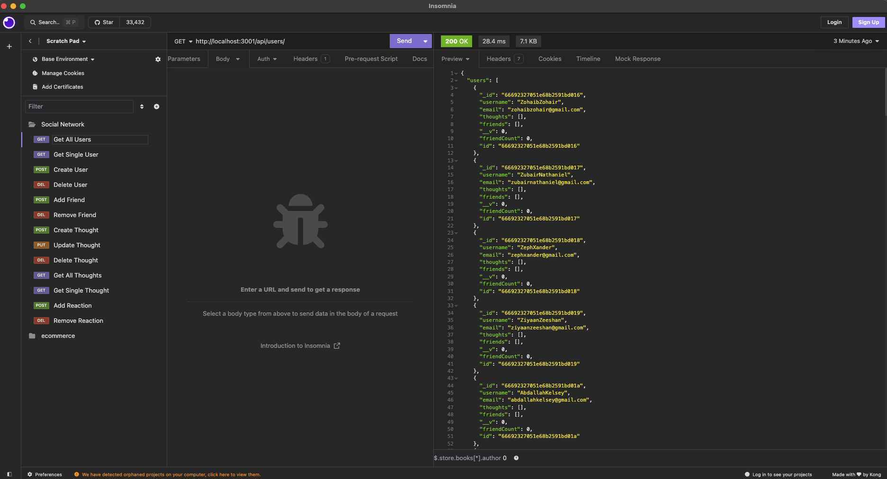
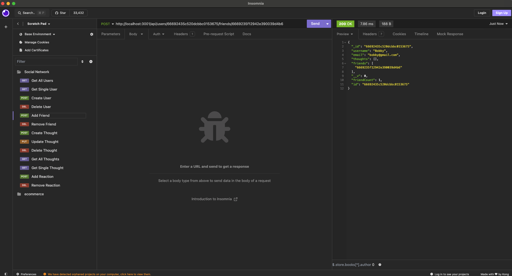
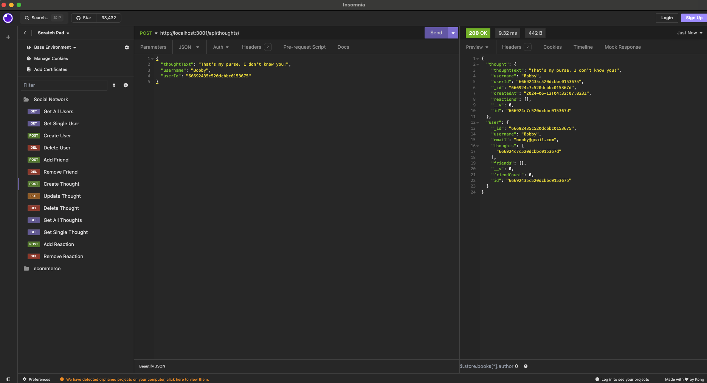
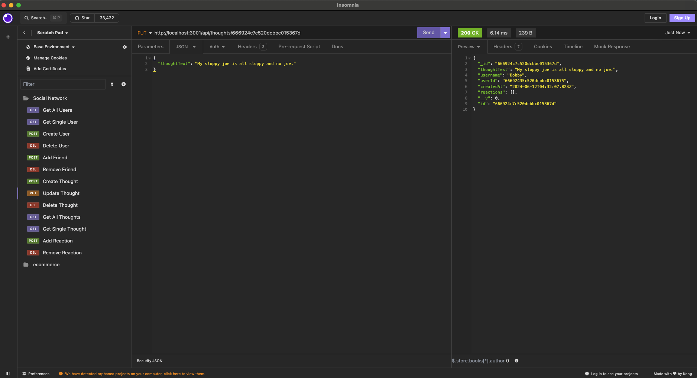
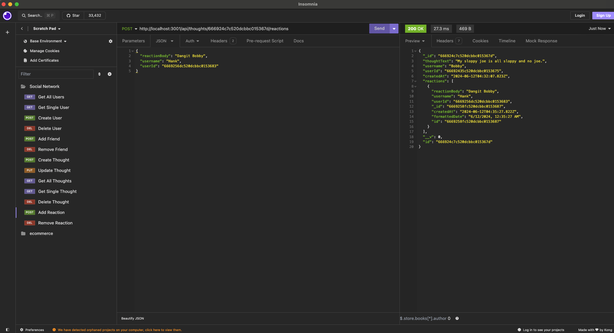

# NoSQL: Social Network API

##### Table of Contents

 [Description](#description)  
 [Installation](#installation)  
 [Usage](#usage)   
 [Video Walkthrough](#video-walkthrough)    
 [Tests](#tests)  
 [Questions](#questions)  
 [License](#license)

## Description

This project is an API for a social network web application where users can share their thoughts, react to friends’ thoughts, and create a friend list. The API is built using Express.js for routing and MongoDB with the Mongoose ODM for database management.

## Installation

1. Clone the repository.
```
git clone git@github.com:dgomie/laughing-funicular.git
```

2. Run npm install to install dependencies.  

3. Run the following commands to set up the database with dummy users:

```
npm run seed
```


## Usage

To start the server, run the command:

```
npm start
```

Alternatively, if in development, run the command:

```
npm run dev
```

The API will be accessible at http://localhost:3001.

## Video Walkthrough
A video demonstration of the setup of this application and how to access the API routes can be found here:

[Video Walkthrough](https://drive.google.com/file/d/1f3Bel3NX12dO5Mru1oFFyy66Nf2y1vON/view?usp=drive_link)


## Tests

Use [Insomnia Core](https://insomnia.rest/) to test the API routes.

1. Open Insomnia Core.
2. Import the Insomnia Core workspace containing the API requests.
3. Test the API requests for users, thoughts, and reactions.

  
  
  
  



## Questions

For any questions regarding the repository, contact me via:

- Github: [dgomie](https://www.github.com/dgomie)
- Email: <a href="mailto:danny.f.gomez@gmail.com">danny.f.gomez@gmail.com</a>

## License

